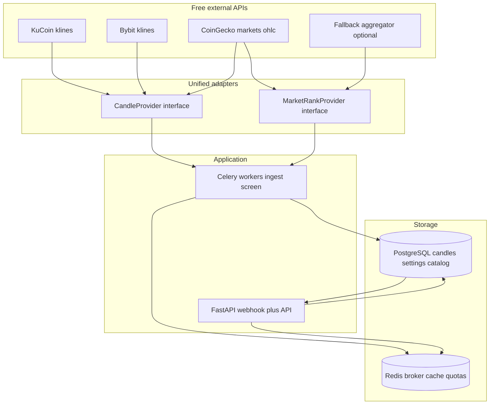

# Матрица API, хранилище и платформа (обновление)

## Ограничения (уточнения)

- **Только бесплатные API** — без платных тарифов CoinGecko Pro, Etherscan Pro и т.п. В плане заложены **ротация и fallback** между провайдерами + **агрессивный кэш** (Redis) и **дедупликация запросов**, чтобы укладываться в лимиты.
- **PostgreSQL** — каноническое хранилище **истории свечей** и **пользовательских настроек** (watchlist, пороги волатильности, режимы, флаги уведомлений и т.п.). Сейчас часть настроек живёт в Redis через `SettingStorage` в [project/dispatcher.py](project/dispatcher.py) — в новой версии это переносится в PG.
- **Redis** — остаётся для **Celery broker/backend** и **краткоживущего кэша** (квоты внешних API, дедуп запросов), но не как основное хранилище настроек пользователя.
- **Единый адаптер** — несколько внешних клиентов за интерфейсом с **одинаковым форматом ответа** (нормализованная свеча, нормализованный тикер/рынок).
- **uv** — менеджер зависимостей и lock-файл вместо pip.
- **Полный rewrite** приложения допустим (без сохранения legacy-архитектуры).
- **FastAPI + aiogram**, **Celery сохранить** — основной процесс FastAPI (JSON API + health + отдача TWA статики/прокси), aiogram как async Telegram-бот (**только webhooks**), Celery worker для фоновых задач; **async HTTP** (`httpx`) для I/O к биржам.
- **Python 3.14** — целевая версия рантайма; в контейнере использовать базовый образ Python 3.14.
- **Попытаться отключить GIL (free-threaded Python)** если доступно в 3.14 и даёт выигрыш для CPU-bound частей (расчёт индикаторов/корреляций); если усложняет сборку/стабильность — оставить стандартный build и масштабировать воркеры Celery.
- **Без backward compatibility** с текущим синхронным `python-telegram-bot` dispatcher из [project/dispatcher.py](project/dispatcher.py): миграция напрямую на aiogram.

Текущая база в репозитории: [project/api/kucoin.py](project/api/kucoin.py), [project/api/bybit.py](project/api/bybit.py), [project/api/coingecko.py](project/api/coingecko.py), [project/app.py](project/app.py) (Flask), Celery в [project/celery_app.py](project/celery_app.py).

Также уже есть полезные утилиты/каркас в `project/core`, которые **переиспользуем** в rewrite (без переписывания с нуля):

- [project/core/config.py](project/core/config.py): `pydantic-settings` конфиг, уже включает PG/Redis и Telegram secrets.
- [project/core/db_session.py](project/core/db_session.py): async SQLAlchemy engine/sessionmanager + dependency `get_db_session`.
- [project/core/retry.py](project/core/retry.py): async retry decorator с backoff.
- [project/core/run_in_executor.py](project/core/run_in_executor.py): безопасный адаптер для запуска sync кода в async flow (если где-то останутся sync SDK).
- [project/core/repository.py](project/core/repository.py): базовый репозиторий для изоляции DB операций (нужно лишь выровнять импорты под наш модуль `project.*`).
- [project/core/caches.py](project/core/caches.py): декоратор кэширования на Redis через `aiocache` (в файле сейчас есть несостыковка импортов `app.*` — при реализации приведём к `project.*`).

---

## 1. Каталог (top-300) и выбранный universe (бесплатно)

- **Важно (MVP):** в первой версии **не трекаем весь top-300**. Top-300 используется как **каталог для выбора**, а трекинг (свечи, индикаторы, WS-события, алерты) идёт только по **выбранным пользователем** монетам.
- **Основной источник каталога:** CoinGecko `GET /api/v3/coins/markets` (`order=market_cap_desc`, пагинация `per_page=100`, `page=1..3` → 300 записей). Поля: `market_cap`, `fully_diluted_valuation`, `symbol`, `id`.
- **Лимиты:** на бесплатном Demo/public лимиты низкие. **Стратегия:** обновлять каталог раз в N часов/сутки (в PG + при необходимости hot-cache в Redis), а сетевые запросы (свечи/WS) запускать только по выбранным монетам.
- **Fallback при 429 / лимите:** второй **бесплатный** агрегатор с похожим ответом (например **Coinpaprika** `GET /v1/tickers` с сортировкой по rank/market cap — уточнить поля FDV; или **CryptoCompare** top list — сравнить наличие FDV). Реализация через тот же адаптер `MarketRankProvider` → единая модель `RankedCoin`.
- **Маппинг контрактов:** CoinGecko `GET /api/v3/coins/{id}` — `platforms` (бесплатно, но дорого по квоте при 300 id); выгружать **батчами** и кэшировать в PG таблицу `coin_metadata` с TTL сутки+.

### Скип стейблкоинов из каталога

Требование: из каталога top-300 нужно **исключать стейблкоины**.

Стратегия (best-effort на бесплатных API):

- **Primary**: если агрегатор даёт явный признак (категория/теги/`stablecoin=true` и т.п.) — фильтровать по нему.
- **Fallback**: поддерживать небольшой denylist по символам/ID (например USDT, USDC, DAI, TUSD, FDUSD, USDP, PYUSD, USDE, FRAX и т.п.) и обновлять по мере обнаружения.

Выход каталога: `catalog_coins = top_300_non_stablecoins`.

Universe для трекинга: `tracked_coins = user_selected ∩ catalog_coins` (плюс опционально allowlist “вне топ-300”, если понадобится).

---

## 1.1. Пользовательские настройки → PostgreSQL (вместо Redis)

Сейчас в коде настройки/списки монет для уведомлений завязаны на Redis-хранилище (`SettingStorage` в [project/dispatcher.py](project/dispatcher.py)). В новой версии:

- **Источник истины**: PostgreSQL (нормализованные таблицы + миграции Alembic).
- **Пример сущностей (черновик)**:
  - `telegram_users` (`telegram_id`, `created_at`, …)
  - `user_settings` (FK на пользователя, `volatility_threshold`, `notifications_enabled`, `app_mode`, …)
  - `user_tracked_assets` (FK, `base_asset`, `quote_asset`/`market`, `enabled`, `added_at`)
- **Redis**: только ускорение/временные структуры (опционально), но не единственное место, где живут настройки.

---

## 2. Объём и мультитаймфрейм → PostgreSQL

| Источник                         | Что даёт                                      | Примечание                                                                             |
| -------------------------------- | --------------------------------------------- | -------------------------------------------------------------------------------------- |
| **KuCoin** public REST           | Klines, несколько `type` (1min … 1day), OHLCV | Без API key для маркет-данных; лимиты — см. документацию, backoff.                     |
| **Bybit** public REST            | Spot klines, несколько `interval`             | Публичные эндпоинты; ключи не обязательны для kline.                                   |
| **CoinGecko** `/coins/{id}/ohlc` | OHLC без объёма на некоторых интервалах       | Хуже для объёма; как **запасной** провайдер свечей в адаптере, если на бирже нет пары. |

**Адаптер:** протокол/ABC `CandleProvider.fetch_ohlcv(symbol, timeframe, start, end) -> list[NormalizedCandle]` где `NormalizedCandle` — UTC open time, open/high/low/close, volume, quote_volume (если есть), `source`.

**TimescaleDB (рекомендация):** свечи хранить в hypertable (Timescale extension поверх PostgreSQL).

- Базовая таблица вида `(source, base_asset, quote, timeframe, open_time_utc)` + OHLCV (и объёмы).
- Уникальность: `(source, base_asset, quote, timeframe, open_time_utc)` чтобы ingest был идемпотентен.
- Индексы: `(base_asset, quote, timeframe, open_time_utc DESC)` + `(source, timeframe, open_time_utc DESC)` для выборок/фоновых джоб.
- Timescale политики:
  - **retention** (например хранить 1m свечи N дней, 5m — больше, 1h/1d — ещё больше)
  - **compression** для старых chunk’ов
  - опционально continuous aggregates позже (если потребуется быстрый ресемплинг).

**Поток:** Celery-периодика догружает «хвост» свечей с бирж → upsert в PG → расчёт индикаторов **из PG**, а не из сети при каждом запросе.

---

## 2.1. Крупные покупки и “крупные bid уровни” (поддержка) через WebSocket

Цель: детектить (a) **large buys** по рынку и (b) **стенки поддержки** в стакане. Это делается не webhook’ами (их биржи почти никогда не дают на рыночные события), а **WebSocket** подписками на публичные каналы.

### A) “Крупные покупки” (prints) через stream сделок

- Источник: **KuCoin/Bybit WebSocket trades** (public).
- Сигнал:
  - `notional_usdt = price * qty` (или `turnover` если есть) больше порога (фиксированного или относительного).
  - Кластеризация: если за окно T=5–20s сумма notional по buys > порога → событие `LargeBuyCluster` (ловит “разбитые” ордера).
- Примечания:
  - Важнее не “одна сделка”, а **серия сделок** на тонких рынках.
  - Нужна дедупликация по trade id/sequence и устойчивость к reconnect.

### B) “Крупные bid уровни” (поддержка) через order book L2

- Источник: **KuCoin/Bybit WebSocket order book (L2)**.
- Сигнал:
  - Для каждого snapshot/update поддерживать локальное состояние top-N уровней.
  - Детектить уровни, где `bid_size * price` > порога (в USDT) и/или размер >> медианы уровня.
  - Отдельно детектить “wall pulled” (уровень исчез) и “wall eaten” (уровень снизился серией трейдов) — полезно как анти-spoofing.
- Выход: события `SupportWallDetected`, `SupportWallRemoved`, `SupportWallEaten`.

### Хранение (PG) и интеграция в скоринг

- Новые таблицы (черновик):
  - `market_trades` (сырые крупные сделки только выше порога, чтобы не раздувать объём) или агрегаты `trade_clusters`.
  - `orderbook_walls` (стена: цена, размер, notional, время появления, время исчезновения, причина).
- В скоринг “лонг/шорт”:
  - large-buy-cluster + rising volume + тренд на ТФ → повышаем long score
  - support wall near price + не снята → bullish bias
  - wall pulled часто/быстро → риск спуфинга (понижаем уверенность)

---

## 3. Индикаторы и корреляция

Без изменений по сути: **локальный расчёт** из рядов OHLCV в PG с библиотекой **`ta`** (technical-analysis, pure Python). Корреляции — между колонками индикаторов или между активами по выровненным по времени close.

Примечания:

- **Выбор v1**: `ta` (простая установка, без C-зависимостей).
- **Fallback**: при необходимости большего набора индикаторов или скорости — `pandas-ta` или TA-Lib (учесть сборку образа и зависимости).

---

## 4. Market cap, FDV (бесплатно)

- CoinGecko `/coins/markets` и при необходимости деталь `coins/{id}` — **FDV и mcap на бесплатном тарифе**, но с **кэшем**.
- **DeFiLlama** — бесплатные REST для TVL протоколов (если понадобится mcap/TVL для отдельных токенов) — как дополнительный **опциональный** адаптер.

---

## 4.1. Paper trading (симуляция сделок) и сбор статистики

Поскольку реальную торговлю пока не реализуем, вместо kill-switch в v1 делаем **paper trading**: прогон сигналов и “виртуальных сделок” на исторических свечах и/или в near-real-time режиме.

### Результат симуляции

- На выходе для каждого решения: `LONG/SHORT/WAIT` + `confidence` + причины.
- Если `LONG/SHORT`: фиксируем виртуальный вход, правила выхода (TP/SL/таймаут), комиссию/проскальзывание (простая модель), итоговый PnL.

### Где выполняется

- Фоновая Celery-задача:
  - периодически пересчитывает сигналы по `tracked_coins`
  - симулирует сделки (по заранее заданной стратегии исполнения)
  - пишет результаты в БД (Timescale/PG): `paper_trades`, `paper_positions`, `signal_events`.

### Зачем это нужно сейчас

- Позволяет **проверять логику** и сравнивать версии скоринга без реальных денег.
- Даёт датасет для “уверенности” (калибровка confidence по историческим результатам).

---

## 5. Холдеры и концентрация (строго бесплатно — ограничения)

Полноценный «топ-20 кошельков = 90% supply» для всех сетей **часто недоступен** без платных explorer API.

**Реалистичный scope:**

- **EVM:** публичные **Blockscout**-инстансы на части сетей отдают JSON API со списком холдеров (нестандартизировано) — можно добавить как опциональный `HolderProvider` с осторожным парсингом и жёстким rate limit.
- **Etherscan family free key:** низкий RPS; часть методов по холдерам может быть недоступна на free — проверить актуальный список; если недоступно — метка `holders_unavailable`.
- **Solana:** без бесплатного индексатора с топ-холдерами в едином виде — **N/A** в MVP или очень узкий список mint с публичного explorer (если найдётся стабильный бесплатный endpoint).
- **Эвристика без ончейн:** для монет без контракта / без данных — не блокировать скринер; флаг «on-chain risk unknown».

Итог для плана: **метрика концентрации холдеров — best-effort**, не часть строгого SLA на бесплатном стеке.

---

## 6. Лонг / шорт

По-прежнему слой правил/скоринга над данными из PG + mcap/FDV + флаги риска; disclaimer обязателен.

---

## 7. Telegram Web App и уведомления

- Уведомления: текущий подход **Bot API** (`send_message`).
- **aiogram**: **только webhooks** — webhook-роут в FastAPI (aiogram webhooks), без long polling и без использования Flask.
- JSON API для React TWA на том же FastAPI; проверка `initData`.

---

## 8. Платформа: uv + FastAPI + Celery

| Тема                  | Решение                                                                                                                                                                                                         |
| --------------------- | --------------------------------------------------------------------------------------------------------------------------------------------------------------------------------------------------------------- |
| **uv**                | `pyproject.toml` с зависимостями, `uv lock`, в Docker `COPY pyproject.toml uv.lock` + `uv sync --frozen`; dev-команды в README через `uv run`.                                                                  |
| **FastAPI**           | Lifespan: инициализация пула к PG (asyncpg или SQLAlchemy async), httpx client при необходимости. Telegram интеграция через **aiogram** (**webhook endpoint внутри FastAPI**, без polling).                         |
| **Celery**            | Оставить broker/backend (Redis), задачи ингеста свечей и пересчёта скринера; воркер может использовать **синхронные** драйверы к PG (`psycopg`) или async через gevent — выбрать один стиль в реализации.       |
| **Async внешние API** | В FastAPI routes и/или в отдельном async-сервисе ингеста — `httpx.AsyncClient`; в Celery чаще проще sync `httpx`/`requests` с тем же адаптером (две thin-обёртки над одним парсером ответа).                    |
| **Python version**    | **Python 3.14** в Dockerfile/CI, `requires-python` в `pyproject.toml`. Опционально: экспериментальная сборка **free-threaded (disable GIL)** в отдельном Docker target/образе для сравнения производительности. |

---

## 8.1. LLM summary (Gemini free) для объяснения сигналов

Требование: использовать **бесплатный Gemini** (как в примере) для “AI summary” на базе наших расчётов.

Роль LLM в MVP:

- не “торговать вместо нас”, а **суммаризировать**:
  - что видят индикаторы на ТФ
  - почему итог `LONG/SHORT/WAIT` и какие факторы “за/против”
  - какие факторы за/против лонга/шорта
  - итог: `LONG/SHORT/WAIT` + confidence + краткое объяснение

Ограничения/безопасность:

- **best-effort**: если LLM недоступен/лимит → отправляем non-LLM текст (детерминированный summary).
- **кэширование**: ключ на `(symbol, timeframe_set, ts_bucket)` чтобы не тратить квоту.
- **budget**: лимит вызовов в минуту/час и max tokens.
- **prompt hygiene**: отдаём только агрегированные числа/флаги, не секреты.

---

## Рекомендуемый бесплатный стек API (MVP)

1. **KuCoin + Bybit** — основной источник OHLCV; ротация при лимите/ошибке.
2. **CoinGecko** — топ-300, mcap, FDV, метаданные контрактов (редко и кэш).
3. **Запасной рынокный список** — второй бесплатный агрегатор под общий интерфейс (уточнить по полям FDV при выборе).
4. **DeFiLlama** — по необходимости TVL.
5. **Ончейн-холдеры** — только если найдены устойчивые бесплатные endpoints под выбранные сети; иначе N/A.

---

## Следующие шаги после утверждения

1. Зафиксировать точные лимиты выбранных бесплатных API (документация) и таблицу TTL.
2. Спроектировать миграции PG (Alembic) и первую схему свечей.
3. Реализовать адаптер + ингест в Celery + замена Flask на FastAPI + aiogram webhooks.
4. Перевести репозиторий на uv и обновить CI/Docker.

---

## 9. CI/CD (обновление: простой, бесплатный, популярный)

Текущий подход в [README.md](README.md) с `webhook` + `supervisor` и кастомными скриптами действительно выглядит устаревшим и усложняет сопровождение.

### Рекомендованный вариант (самый популярный для небольших OSS/self-hosted проектов)

**GitHub Actions + GHCR (GitHub Container Registry) + deploy по SSH на VPS**.

- **CI (в Actions)**:
  - `ruff`/тесты (pytest) в контейнере/на runner’е
  - сборка Docker-образов (app + celery/worker) под Python 3.14
  - публикация в GHCR (бесплатно для публичных репо; для приватных — уточнить лимиты)
- **CD (в Actions)**:
  - `ssh` на сервер (VPS)
  - `docker compose pull && docker compose up -d`
  - опционально: миграции Alembic перед запуском воркеров

Плюсы: **минимум инфраструктуры**, один стандартный стек, легко повторить, огромная база примеров.

### Альтернативы (если захотим ещё проще)

- **Watchtower**: сервер сам периодически подтягивает новые образы из registry и перезапускает контейнеры.
  - Плюсы: нет SSH deploy step.
  - Минусы: меньше контроля/атомарности; миграции и порядок рестарта сложнее.
- **Self-hosted GitHub Runner на сервере**:
  - Плюсы: можно деплоить без SSH, запускать `docker compose` локально.
  - Минусы: runner нужно обслуживать (но для маленького проекта всё ещё ок).

### Как это увязывается с новым стеком

- FastAPI (webhook) и aiogram — один HTTP сервис (контейнер `app`).
- Celery worker — отдельный сервис в `docker-compose.yml`.
- Redis + PostgreSQL — сервисы инфраструктуры.

